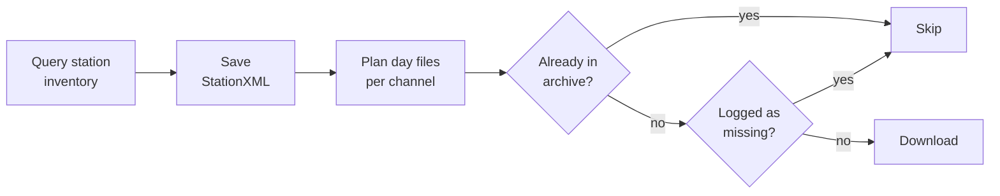

# Resuming and updating archives

FDSN Rush compares what the server offers with what is on disk, and downloads only the difference. One configuration file can therefore start an archive, resume an interrupted download and keep the archive up to date.

## What happens on every run



1. **Inventory.** The station inventory is fetched from each data centre.
2. **Clean up.** Leftover `*.partial` files from an interrupted run and empty day files are deleted from the archive.
3. **Metadata.** The StationXML in `metadata/` is downloaded again and overwritten with the current version.
4. **Plan.** Every channel–day in the time range that passes your [selection](selecting-data.md) becomes a candidate.
5. **Skip.** A candidate is skipped if its day file already exists, or if the server previously answered with *404 Not Found*.
6. **Download.** The remaining day files are downloaded and written.

## Interrupting a download

Stop a running download at any time with ++ctrl+c++. Data is streamed to `<dayfile>.partial` and moved to its final name only when the day is complete. An interrupted day therefore never looks finished. Start the same command again and it continues where it stopped.

## Updating an archive

Use `"today"` as the end of the time range:

```json
"time_range": ["2026-01-01", "today"]
```

Each run then downloads everything new up to and including yesterday. To keep an archive current, schedule the command, for example with `cron` every morning at 06:00 UTC:

```cron
0 6 * * * cd /data/my-archive && fdsn-rush download config.json >> download.log 2>&1
```

!!! tip "Late-arriving data"

    Data centres sometimes receive data hours or days late. A day file that was complete when FDSN Rush wrote it is never downloaded again. If gaps matter, delete the day files of the last few days before a run so they are fetched again.

## Missing data and `remote_errors.log`

If a server answers a request with *404 Not Found*, it has no data for that channel and day. FDSN Rush records this in `remote_errors.log` at the root of the archive:

```text title="data/remote_errors.log"
GE.STU..HHZ,2026-09-14,geofon.gfz.de,404,2026-09-30T06:00:12.461523+00:00
```

Each line holds the channel, the day, the server, the status code and the time of the request. Day files listed here are not requested again from the same server. This keeps reruns over large archives fast, because known gaps cost no requests.

To retry missing days, for example after a data centre has backfilled them, delete the matching lines, or the whole file.

Other errors, such as timeouts, *5xx* server errors and broken connections, are **not** logged. Those day files are simply attempted again on the next run.

## Very short fragments

Day files are cleaned before they are written. Traces shorter than `min_length_seconds` (default: one minute) are dropped, because these are typically glitches at the edges of gaps. If nothing is left after cleaning, no file is written and the day is retried on the next run.
